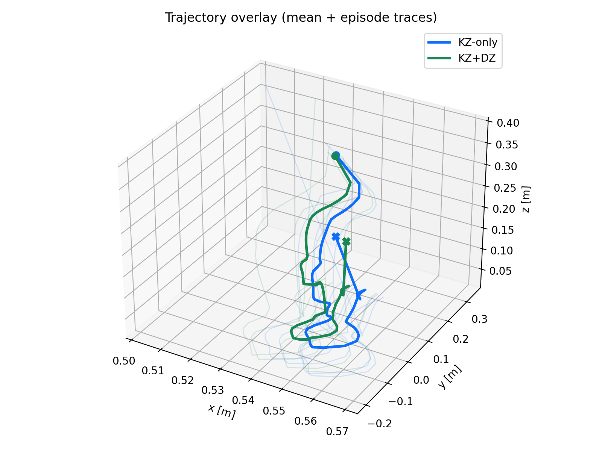

# VTT_RL_PT: Procedural Trajectory for Robotic Polishing

Procedural Trajectory (PT) environment for Isaac Lab 2.0.1.

This repository hosts the **Fixed Mode** polishing task used in the thesis results, with
operational-space control (OSC) and variable impedance.

VTT_RL_PT provides a simulation framework to execute a procedural polishing trajectory while
learning to adapt impedance parameters in contact. The task follows a fixed phase sequence
(home → approach → contact → lateral motion → rise), and the policy modulates stiffness (and
optionally damping) to improve stability under physical variability. Expected outcomes are
stable trajectory execution, reduced oscillations in contact, and improved robustness compared
to a fixed-impedance OSC baseline.



## Whats Included

- `source/vtt_rl_pt/robo_pp_fixed/` - Fixed-mode polishing environment (OSC + impedance)
- `scripts/` - Training, evaluation, grid search, and analysis scripts
- `examples/` - Placeholder for demo trajectories/configs (to be added)
- `docs/` - Placeholder for public docs (thesis figures/snippets can be added later)

## Quick Start

### 1. Prerequisites

- Isaac Lab 2.0.1 installed and working
- Python 3.10
- CUDA 11.8+ (for GPU acceleration)

### 2. Installation

Clone the repository and install the extension package in editable mode:

```bash
git clone <REPO_URL>
cd VTT_RL_PT
python -m pip install -e source/vtt_rl_pt
```

### 3. Train

```bash
cd <ISAAC_LAB_PATH>
./isaaclab.sh -p /path/to/VTT_RL_PT/scripts/train.py --num_envs <N> --max_iterations 500
```

### 4. Evaluate

```bash
./isaaclab.sh -p /path/to/VTT_RL_PT/scripts/play.py --checkpoint <PATH>
```

## Data Root (for scripts)

Many scripts write outputs to a data root. Override it with:

```bash
export VTT_RL_DATA=/path/to/data_root
```

Default is `VTT_RL_PT/data/`.

## Usage Guide

See `docs/USAGE.md` for the main scripts and workflows.

## Environment Details (Fixed Mode)

- **Action space**: continuous (impedance modulation along selected axes)
- **Observation space**: sequence of robot/joint states + contact + phase info
- **Trajectory**: fixed procedural keypoints (home → approach → descent → contact → rise)
- **Control**: OSC with variable impedance (Kp, damping)

## File Structure

```
VTT_RL_PT/
├── docs/                 # Public documentation (optional)
├── examples/             # Demo scripts / trajectories
├── scripts/              # Train/play/utility scripts
├── source/               # Isaac Lab extension-style package
│   └── vtt_rl_pt/
│       ├── config/
│       │   └── extension.toml
│       ├── robo_pp_fixed/          # Fixed-mode environment package
│       ├── vtt_rl_pt/              # Placeholder module
│       └── setup.py
├── LICENSE
├── pyproject.toml
└── .gitignore
```

## Citation (TBD)

If you use this environment in your research, please cite:

```bibtex
@software{vtt_rl_pt_2026,
  title = {Fixed Mode Polishing with Variable Impedance Control for Isaac Lab},
  author = {Bajrami, Albin},
  institution = {VTT Technical Research Centre of Finland and Università Politecnica delle Marche},
  year = {2026},
  publisher = {GitHub},
  url = {https://github.com/AlbinEV/VTT_RL_PT}
}
```
